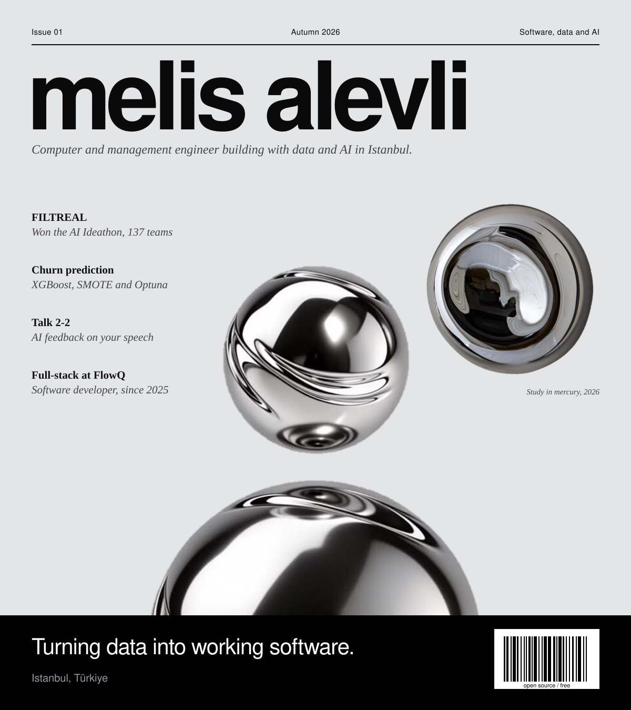

  <picture>
    <source media="(prefers-color-scheme: dark)" srcset="assets/cover-dark.svg">
    
  </picture>

  <a href="#experience">Full Stack Developer</a> ·
  <a href="#experience">Software Analyst</a> ·
  <a href="#experience">AI &amp; Data Analyst</a> ·
  <a href="#experience">Team Leader</a> ·
  <a href="mailto:melisalevli2@gmail.com">Say hello</a>

 

<table>
<tr>
<td width="50%" valign="top">

### Editor's note

I'm a computer engineer and management engineer, currently doing a Master of Science in Computer Science, focused on artificial intelligence, in the United States. I graduated from Bahçeşehir University with a double major in Computer Engineering and Management Engineering, and spent a semester at Coburg University of Applied Sciences in Germany on an Erasmus+ scholarship.

I like work where data, AI and product thinking meet.

</td>
<td width="50%" valign="top">

### Currently

- Master of Science in Computer Science (AI focus), United States
- Previously a full stack developer at **FlowQ** (Dec 2025 – Jul 2026)
- Ask me about: machine learning, LLM projects, data analysis, Unity, organizing tech events

</td>
</tr>
</table>

 

## Featured

### Projects

<b>FILTREAL</b> &nbsp; YOLO, LLaMA

 
An LLM project that combines vision and language models. It won first place among 137 teams at the AI Ideathon, organized by the AI and Technology Academy.
  

<b>Telecom churn prediction</b> &nbsp; Python, XGBoost, Optuna

 
My capstone: a scalable model that predicts customer churn. I handled class imbalance with SMOTE, ADASYN, ROS, RUS and SMOTE-ENN, tuned XGBoost, Random Forest, SVM and ANN models with Optuna and cross-validation, and turned the feature importances into business strategy.
  

<b>Talk 2-2</b> &nbsp; AI, web

 
A website that analyzes your speech with AI and gives personalized communication feedback.
  

### Experience

- **FlowQ**, Full Stack Developer (Dec 2025 – Jul 2026). Worked on full-stack development.
- **Turkish Technology**, Software Analyst Intern (Jul – Aug 2025). Gave analytical support for cockpit software solutions for Turkish Airlines pilots, in the Team Support Solutions unit.
- **Orka Holding** (Damat, Tween, D'S), AI & Data Analyst Intern (Dec 2024 – Apr 2025). Applied AI prediction models and SQL analysis to design CRM strategies, and supported KPI development in Power BI.
- **AI and Technology Academy**, Trainee (Dec 2024 – Jul 2025). Built Talk 2-2.
- **Google Developer Student Clubs BAU**, Organization Team Leader (Oct 2023 – Dec 2024). Led a multidisciplinary team that planned and ran 20+ technology events in two semesters.
- **Scooter Robotics**, Software Developer & Project Manager (Feb – Aug 2023). Managed Agile Scrum projects and built unmanned surface vehicle (USV) interfaces in Unity.
- **Google Game and Application Academy**, Trainee (Dec 2021 – Jun 2022). Completed an intensive 2D and 3D Unity game development bootcamp.

### Recognition

- **1st place**, AI Ideathon, February 2025. 137 teams.
- **3rd place**, Alternatif Bank Ideathon, April 2021. A QR-based system that makes banking easier for people with disabilities.

 

| Toolbox | |
| :-- | :-- |
| **Languages** |       |
| **Data and AI** |    |
| **Cloud and tools** |    |
| **Apps and games** |   |

 

## Elsewhere

[LinkedIn](https://www.linkedin.com/in/melis-alevli) · [Email](mailto:melisalevli2@gmail.com)
