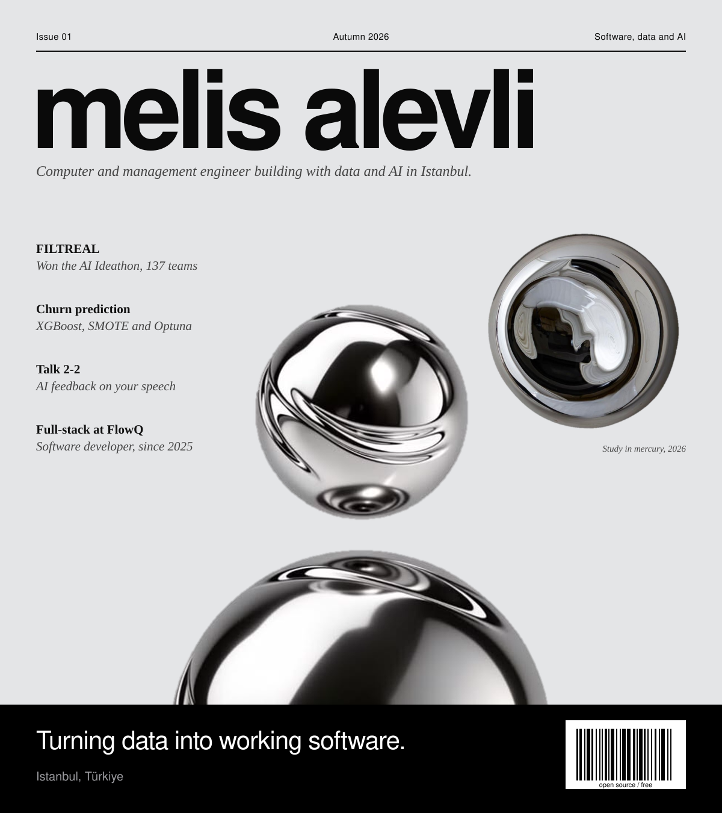

  <picture>
    <source media="(prefers-color-scheme: dark)" srcset="assets/cover-dark.svg">
    
  </picture>

  

 

<table>
<tr>
<td width="50%" valign="top">

### Editor's note

- I like the work where data, AI and product thinking meet.

 
</td>
<td width="50%" valign="top">

### Where

- Master of Science in Computer Science (AI), United States
- Previously a full stack developer at **FlowQ**

 
</td>
</tr>
</table>

 

## Projects

#### **Bunny Dive**
> A web app that lets you explore Wikipedia through a branching trail of related topics, following a path of 14 topics before showing you the complete journey.

#### **FILTREAL**
> An LLM project combining vision and language models to ensure transparency and reliability when accessing accurate information.

#### **Telecom Churn Prediction**
> Developed a scalable predictive model for customer churn, resolving class imbalance using **SMOTE, ADASYN, ROS, RUS,** and **SMOTE-ENN**.
> Tuned **XGBoost, Random Forest, SVM,** and **ANN** models via Optuna and cross-validation, translating feature importance into actionable business strategies.

#### **Talk 2-2**
> Web application that analyzes speech patterns using AI to deliver personalized communication feedback.

 

---

## Elsewhere

[LinkedIn](https://www.linkedin.com/in/melis-alevli) · [Email](mailto:melisalevli2@gmail.com)
